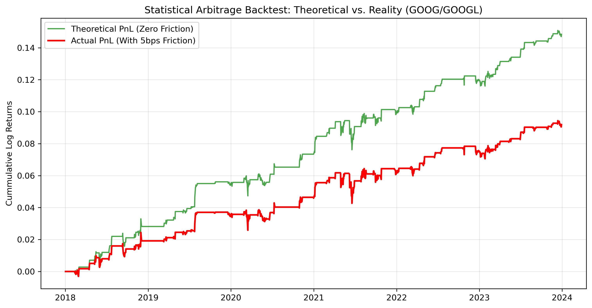

# Empirical Statistical Arbitrage: Cointegration, OU Processes, and Market Friction

## Objective
To build a mid-frequency statistical arbitrage engine targeting share-class inefficiencies (GOOG/GOOGL). The project mathematically proves cointegration, models the spread as an Ornstein-Uhlenbeck (OU) process to extract the mean-reversion half-life, and backtests a Z-score trading strategy subjected to realistic market friction.

## 1. Statistical Foundations & Cointegration
Unlike amateur pairs-trading models that rely on unstable correlation, this engine requires strict mathematical cointegration.
* **Logarithmic Scaling:** Prices are converted to log-space to neutralize heteroskedasticity (non-stationary variance) caused by absolute price appreciation over the 6-year horizon.
* **Hedge Ratio:** Calculated via Ordinary Least Squares (OLS) regression to ensure a market-neutral spread.
* **Stationarity Proof:** The Augmented Dickey-Fuller (ADF) test formally rejects the null hypothesis of a random walk ($p\text{-value} = 0.0023$), proving the spread is a stationary, mean-reverting time series.

## 2. Stochastic Modeling: The Ornstein-Uhlenbeck Process
To determine the viability and capital lock-up of the trade, the spread is modeled as a discrete Ornstein-Uhlenbeck process:

$$dx_t = \theta (\mu - x_t)dt + \sigma dW_t$$

By regressing the daily change in the spread against the lagged spread, we extract the speed of mean reversion ($\theta$). 
* **Estimated Half-Life:** $13.13$ trading days.
* **Strategy Implication:** The ~13-day half-life confirms this as a viable mid-frequency structural arbitrage opportunity, avoiding the infrastructure requirements of HFT while maintaining sufficient capital turnover.

## 3. Backtest & Market Microstructure (The Friction Reality Check)
A dynamic Z-score algorithm was implemented, going long/short when the spread deviates by $2\sigma$ from its rolling mean. However, theoretical PnL is irrelevant without accounting for market microstructure. 

A rigorous friction tax (5 basis points per leg) was applied to all 113 executed trades to simulate the bid-ask spread and institutional commission drag.

### PnL Results (2018 - 2024)
* **Total Trades Executed:** 113
* **Theoretical PnL (Zero Friction):** +14.84%
* **Actual PnL (5bps Friction):** +9.19%

### Conclusion
While market friction consumed approximately 38% of the theoretical gross profit, the underlying alpha is robust enough to survive institutional execution costs, yielding a positive, uncorrelated absolute return.
